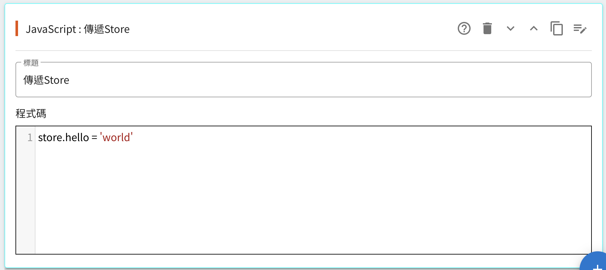
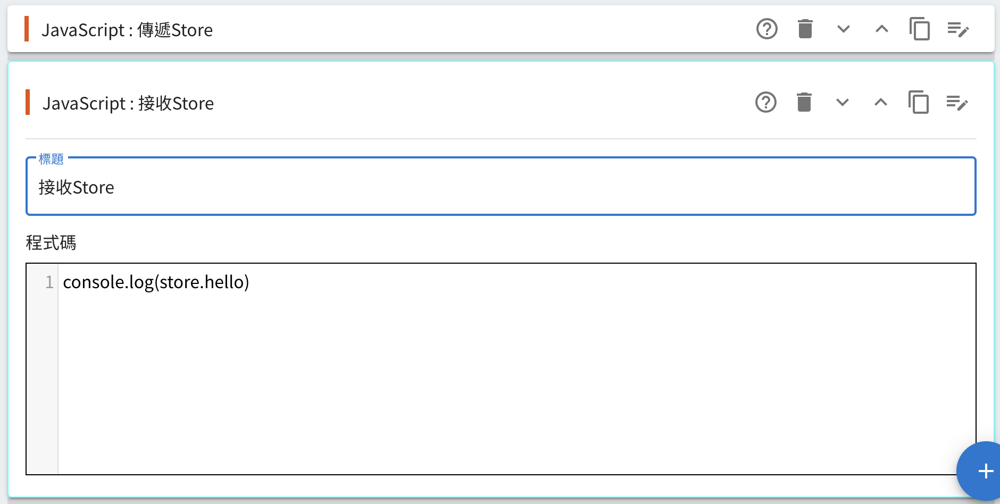
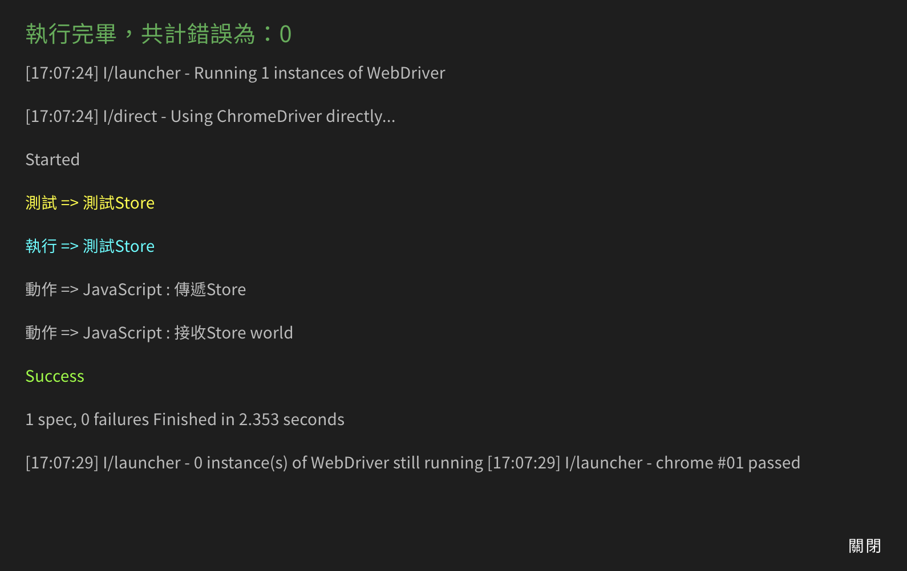

<p align="center"></p>

<p align="center" style="font-size:2em">The Beta Now</p>

<br>

## Table Of Contents

* [Summary](#summary)
* [安裝](#%e5%ae%89%e8%a3%9d)
* [建議](#%e5%bb%ba%e8%ad%b0)
* [操作手冊](#%e6%93%8d%e4%bd%9c%e6%89%8b%e5%86%8a)

---

## Summary

WEG(WEB-E2E-GUI)是以[Protractor](https://www.protractortest.org/)為底層的可介面操作E2E測試工具。

目標與定位是在中小型專案，大多是人手不足的情況下(大多時候專案只有兩位人員)能夠平均分擔QA的部分，

如果是大型專案或有專門進行QA的團隊基本上可以無視本工具。

WEG有以下特點：

1. 能夠輸出序列化檔案，利於工程師與其他專案管理人員交流。

2. 最終結果仍是輸出`Protractor`專案，就算捨棄GUI工具也能擁有原生的E2E測試檔案。

3. 進行測試時可以看到美麗的測試Log。

4. 可視化與可自定義操作的按鈕介面。

---

## 安裝

WEG仍是較為工程師導向的工具，你必須安裝[NodeJs](https://nodejs.org/en/)才能正常運作。

> 我們必須藉由Node安裝Protractor與相關依賴進行測試運作。

---

## 建議

### JavaScript

雖然盡可能的使用可視化按鍵來操作，但不用幻想不會JavaScript也能暢用WEG，沒有Node的操作經驗大概在安裝就會卡關。

### Protractor

由於所有的程式碼都在`Protractor(jasmine)`中執行，理解其判斷方式與邏輯有助於寫出良好的測試。

> `Protractor`是源於`Angular`的測試工具，但本工具只借用其自動化測試功能，在運行時會關閉`Angular`的檢測。

### 邏輯測試應該通通由Javascript編寫

有時候需要複雜的邏輯驗證，建議直接編寫JavaScript，因此建議由工程師先行編寫測試，再由其他專案負責人補足應用方的應用操作。

---

## 操作手冊

### 應用Store

所有的`Spec`中都有一個全局且獨立的store物件，可以藉由該物件進行誇模板的測試：





運行結果：



### 使用變數

你可以在工具列上看到`(x)`的按鈕，點擊後會出現變數編輯畫面。

在所有文字輸出之後，WEG會將{key}轉換成{value}(不能有空白)，如下：


```js
it('輸出結果', async function() {
    console.log('執行 => C')
    await browser.sleep(120)
    await (async () => {
        console.log('動作 => 驗證網址 包含 KHC-ZhiHao/WEB-E2E-GUI')
        await expect(await browser.getCurrentUrl()).toMatch('KHC-ZhiHao/WEB-E2E-GUI')
        await browser.sleep(100)
    })()
})
```

### 自定義按鈕

你需要理解JavaScript才能開始自訂按鈕，點擊自定義按鈕後可以建立一個按鈕並創造一個範例：

```js
{
    // 短說明
    info: '短說明',
    // 點擊Help按鈕時出現的詳細說明，支援markdown格式
    help: '詳細說明',
    // 本按鈕的主題顏色
    color: '#000000',
    // 按鈕上的文字
    btnText: '按鈕文字',
    // 選項
    props: {
        value: {
            type: 'text',
            info: '毫秒',
            default: '1000'
        }
    },
    // 在模板與測試訊息中出現的文字
    display(props) {
        return '等待' + props.value + '毫秒'
    },
    // 驗證Props的格式是否正確，回傳字串代表錯誤
    validate(props) {
        let result = Number(props.value)
        if (isNaN(result)) {
            return '必須為數字'
        } else {
            return true
        }
    },
    // 輸出成Protractor的文本
    write(props) {
        return 'await browser.sleep(' + props.value + ')'
    }
}
```

#### 輸出結果

所有由`write`返回的結果都會輸出在一個`async`閉包內，因此你可以較大膽地宣告一些行為，輸出如下：

```js
await (async () => {
    console.log('動作 => 等待 1000 毫秒')
    await browser.sleep(1000)
    await browser.sleep(100) // 每個動作都會間格100毫秒
})()
```

> 其實WEG就是將模板轉化成程式碼的工具而已。

#### Event

有些功能比較難在Node中實現，例如：多媒體，此時可以藉由`console.log('@event:{my-event}')`推播event給瀏覽器知道：

##### play-sound

要求播放聲音：

```js
write(props) {
    return `console.log('@event:play-sound')`
}
```

#### 選項列表

`Porp`是使用者操作的核心目標，各類行所需要的屬性如下：

##### text

顯示單行文字輸入框。

```js
{
    type: 'text',
    info: 'label', // 文字框說明
    show: (props) => { return Boolean }, // 回傳true即顯示
    default: 'hello world.' // 預設值
}
```

##### radio-group

顯示多個選項。

```js
{
    type: 'radio-group',
    info: 'label', // 選項說明
    // 顯示的選項，text是顯示文字，value是選取的值
    options: [
        {
            text: '新增',
            value: 'add'            
        },
        {
            text: '清除',
            value: 'clear'  
        }
    ],
    show: (props) => { return Boolean }, // 回傳true即顯示
    default: 'clear' // 預設值
}
```

##### javascript

javascript文字編輯器。

```js
{
    type: 'javascript',
    info: 'editor', // 編輯器說明
    show: (props) => { return Boolean }, // 回傳true即顯示
    default: '{}' // 預設值
}
```
